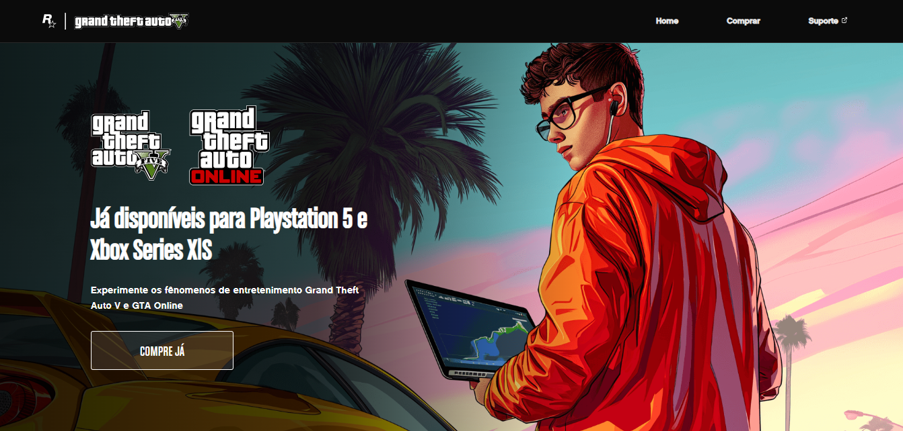
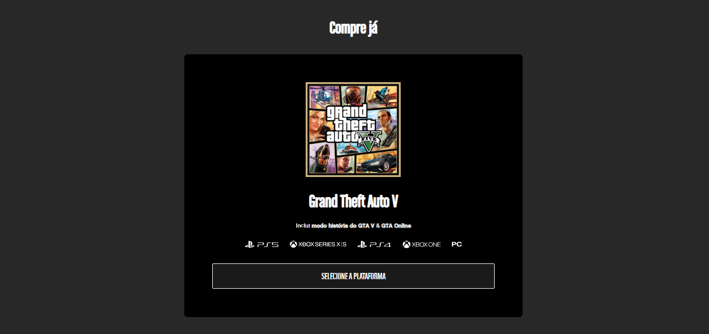

# projeto-gta 

## Uma réplica do site da Rockstar Games feito em HTML, CSS e Javascript

Este projeto consiste em recrear uma landing page da ROCKSTAR GAMES utilizando as linguagens FrontEnd, a saber:
- HTML
- CSS
- Javascript

O site é dividido em três seções:
header: cabeçalho com os elementos 'Home', 'Comprar' e 'Suporte';
Home: Onde se encontra a descrição dos produtos e caixa de destino a seção de compras;
Compras: Onde está de fato o local em que se escolhe o cartão de compras e a plataforma de jogos desejada;

## A replica of Rockstar Games Website made in HTML, CSS and Javacript

This project is a recreation of Rockstar Games landing page using Frontend languages, namely:
- HTML
- CSS
- Javascript

The website is sectioned in three parts:
Header: with the elements 'Home', 'Purchase' and 'Support'.
Home: where the products description and the destination box to the purchase section are located;
Purchases: where actually is the place one chooses the purchase card and the desired game plataform. 

Started in 23/01 and finished in 29/01 - Author: Luiz Felipe - Lizul Dev

Algumas imagens de apresentação/some images for presenting it:

